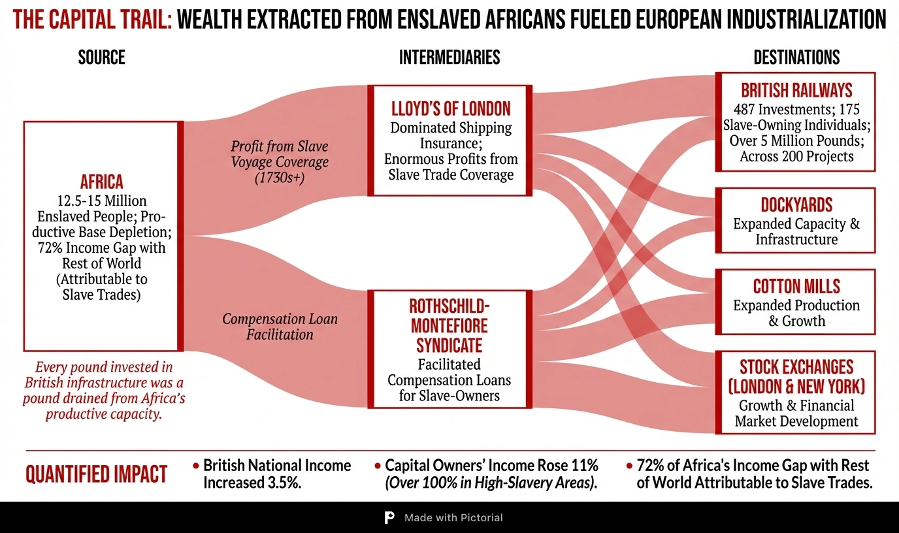
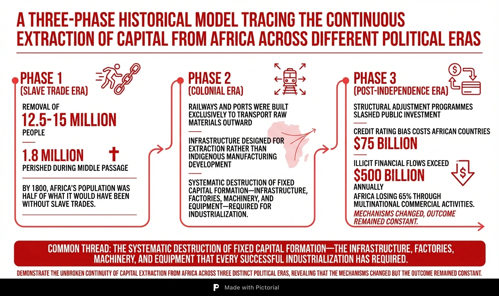
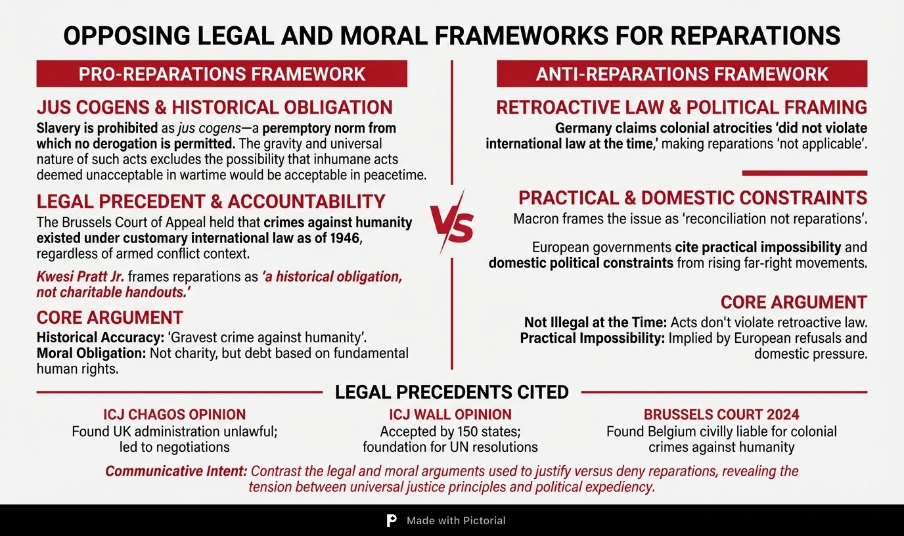
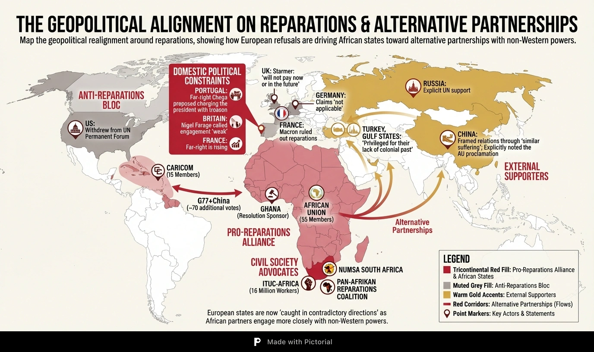

# The Debt That Built the World: Ghana's UN Resolution and the Unfinished Ledger of Transatlantic Slavery

## The Resolution and the Capital Trail

On March 25, 2026, the International Day of Remembrance of the Victims of Slavery, Ghana will table a resolution before the United Nations General Assembly declaring the transatlantic slave trade "the gravest crime against humanity." The resolution, endorsed unanimously at the 39th African Union Summit in Addis Ababa, rests on three pillars: historical accuracy, legal defensibility, and continental alignment.[^1] President John Dramani Mahama, appointed AU Champion for Advancing the Cause of Justice and the Payment of Reparations, has framed the initiative in the language of peremptory norms: slavery is prohibited under international law as *jus cogens*, a principle from which no derogation is permitted.[^2]

The diplomatic language, however, conceals a sharper confrontation. What Ghana is placing before the General Assembly is an economic argument disguised as a legal one. The transatlantic slave trade was, as the British economist John Ross has argued, "the largest reverse transfer of capital in human history."[^3] Over four centuries, between 12.5 and 15 million people were forcibly transported from Africa; 1.8 million perished during the Middle Passage.[^4] By 1800, Africa's population was estimated to be half of what it would have been without the slave trades.[^5] As the Ghanaian journalist Kwesi Pratt Jr. has written, "the ports of Liverpool, the docks of Bristol, the stock exchanges of London and New York were all forged from the flesh and blood of African men, women and children."[^6]

The most rigorous recent scholarship confirms what the capital trail has always suggested. Heblich, Redding, and Voth, in a 2022 study using geographically disaggregated data on slaveholder wealth in Britain, found that places with the highest levels of slavery wealth saw total income increases of more than 40 per cent, with capitalists' income rising by more than 100 per cent. At the aggregate level, slavery wealth increased British national income by 3.5 per cent and capital owners' income by 11 per cent.[^7] Nathan Nunn's cross-country analysis established that if the slave trades had not occurred, 72 per cent of the average income gap between Africa and the rest of the world would not exist; 99 per cent of the gap with other developing countries would be eliminated.[^5]

The capital trail leads to specific, still-functioning institutions. Lloyd's of London, which dominated shipping insurance from the 1730s, made enormous profits extending insurance to slave voyages and insuring enslaved people as cargo. A 2023 Johns Hopkins University study concluded that the financial architectures developed at Lloyd's "helped maintain the institution of slavery."[^8] When slavery was abolished in the British Empire in 1833, the government borrowed 20 million pounds to compensate not the enslaved but the slave owners. The Rothschild-Montefiore syndicate raised the compensation loan, and the UCL Legacies of British Slavery database documents 487 railway investments made by 175 slave-owning individuals, accounting for over five million pounds of capital invested in at least 200 railway projects across Britain.[^9] British taxpayers were repaying the loan to compensate slave owners until 2015.[^10]

Every pound invested in British railways and dockyards was a pound drained from Africa's own productive base. The capital that powered European industrialisation was precisely the capital that Africa lost — leaving the continent, as John Ross has argued, without the fixed capital stock needed to industrialise itself.[^3]

The wealth gap between Africa and Europe is not an accident of development. It is a ledger entry.

## The Extraction Never Stopped

The logic that stripped twelve million people from a continent did not expire with abolition. It changed form. John Ross's three-phase extraction model traces an unbroken arc: the slave trade era removed Africa's most fundamental productive factor, its people; the colonial era built railways and ports designed to transport raw materials outward, not to develop indigenous manufacturing; and the post-independence era perpetuated extraction through structural adjustment, credit rating bias, and illicit financial flows.[^3]

The common thread across all three phases, Ross argues, is the systematic destruction of fixed capital formation — the accumulation of infrastructure, factories, machinery, and equipment that every successful industrialisation has required. While the capital extracted from enslaved labour was building the railways, dockyards, and cotton mills that powered European industrialisation, Africa's own capital stock was not merely stagnant but actively shrinking through population loss and social disintegration. The colonial infrastructure that replaced slavery was designed to move raw materials toward the coast and onward to European factories, not to develop indigenous manufacturing capacity. At independence, Africa's fixed capital stock remained extremely low — too low to support industrialisation. The structural adjustment programmes that followed then compounded the deficit: by slashing public investment, they cut the very mechanism through which a newly independent state could begin to build its capital stock. What Africa confronts today, Ross concludes, is not a deficit of capability but the direct consequence of centuries of systematic capital extraction. What it requires is a substantial increase in the share of net fixed capital formation relative to GDP — the growth driver that the data has repeatedly validated, and that the extractive architecture has repeatedly denied.[^3]

Fred M'Membe, President of the Socialist Party of Zambia, lived through the transition between phases two and three. "I was among the first cohort of children to enrol in school after independence," he has recalled, "free uniforms, books, pencils, and meals provided. The children of leaders shared dormitories with those of workers and farmers. Then neoliberalism arrived, privatisation, deregulation, dismantling the state, and poverty rates soared to 82 per cent in some regions, briefly making Zambia the world's fifth most hungry nation."[^11] The collapse was not accidental. Sub-Saharan African countries under IMF adjustment programmes experienced an average annual 0.3 per cent decline in real per capita incomes from 1991 to 1995. The World Bank projected it would take until 2006 to return to 1982 levels, before structural adjustment had been imposed.[^12] In Africa's ESAF countries, per capita education spending declined by 0.7 per cent annually between 1986 and 1996; Zimbabwe's real per capita expenditure on primary education fell 36 per cent.[^12] Total external debt as a share of GNP for ESAF users increased from 71.1 to 87.8 per cent between 1985 and 1995. By 1996, external debt per capita for sub-Saharan Africa stood at 365 dollars while GNP per capita was 308 dollars. In 1997-1998, repayments to the IMF outpaced new resources, resulting in a net transfer from Africa to the IMF of over one billion dollars.[^12]

The mechanisms of extraction have become more sophisticated, but the direction of the flow has not changed. African countries face average yields of 9.1 per cent on sovereign bonds, compared to 6.5 per cent in Latin America and 4.7 per cent in emerging Asia. Only four of 55 African nations hold investment-grade ratings.[^13] A 2023 UNDP report found that biased credit ratings have cost African countries an estimated 75 billion dollars, including 28 billion in excess interest payments, a figure exceeding all development assistance to Africa in 2021.[^13] Africa loses more than 500 billion dollars annually through illicit financial flows, unfair trade practices, exploitative investment frameworks, and debt servicing; 65 per cent of illicit financial flows originate from multinational companies' commercial activities through transfer mispricing and trade misinvoicing.[^14] Ghana, the country now leading the reparations charge at the UN, retains only 14 per cent of its 9.58 billion dollar gold export value.[^14]

The same extractive logic that once shipped human beings now ships capital.

## Europe's Double Standard: The Racial Hierarchy of Reparations

The question confronting the General Assembly is not whether reparations are feasible. They have been paid before. The question is for whom they are deemed feasible.

Germany has paid more than 90 billion dollars in indemnification to individuals for suffering and losses resulting from Nazi persecution since the Luxembourg Agreement of 1952. The Claims Conference, founded in 1951, has negotiated continuously for over 70 years. In 2025 alone, it distributed approximately 530 million dollars in direct compensation to over 115,000 survivors in 84 countries.[^15] The framework was entirely political, not judicial. Germany's economy did not collapse under the weight of these payments. It achieved the *Wirtschaftswunder*.

In August 2025, the same German government claimed that colonial atrocities in Africa did not violate international law at the time, making reparations "not applicable."[^16]

The Belgian court system has already exposed the contradiction in this legal reasoning. In December 2024, the Brussels Court of Appeal found Belgium civilly liable for crimes against humanity in its colonial treatment of mixed-race children in the Belgian Congo and Ruanda-Urundi. The court rejected the argument that such acts were "not illegal at the time," holding that crimes against humanity existed under customary international law as of 1946, regardless of whether they occurred in the context of armed conflict. Each claimant was awarded 50,000 euros.[^17] The gravity and universal nature of crimes against humanity, the court reasoned, excluded the possibility that inhumane acts deemed unacceptable in wartime would somehow be considered humane in peacetime.

The historical inversions compound. When slavery was abolished, European governments compensated the slave owners. As Kwesi Pratt Jr. has observed: "When slavery was finally abolished, it was not the enslaved who received reparations, but the slave owners."[^6] Britain borrowed what amounts to between 17 and 100 billion pounds in today's money.[^9] France paid 126 million gold francs, equivalent to 1.3 per cent of GNI, to compensate its slave owners in 1849.[^18] Haiti, the first nation to free itself from slavery through revolution, was forced to pay its former enslavers 150 million francs for the right to its own independence. A 2022 analysis by the New York Times estimated that Haitians paid between 22 and 44 billion dollars in today's money, a debt that crippled the nation for over a century.[^18] France recognised slavery as a crime against humanity in its Taubira law of 2001, but President Macron ruled out reparations in 2017, calling instead for "reconciliation."[^19]

In the United Kingdom, Prime Minister Keir Starmer has declared that Britain will not pay reparations "now or in the future."[^19] The pursuit of justice, Pratt has countered, "is not charitable handouts but a historical obligation."[^6]

## The Geopolitical Fracture

Europe's categorical refusal is producing consequences its architects did not intend. A 2025 analysis by Italy's Institute for International Political Studies (ISPI) identified European states as "caught in contradictory directions," attempting to relaunch partnerships with Africa while refusing reparations, at a time when African states are engaging more closely with China, Russia, Turkey, and the Gulf countries, who are "privileged for their lack of a colonial past."[^20]

At the 2024 Forum on China-Africa Cooperation summit in Beijing, the joint declaration explicitly "noted" the AU reparations proclamation.[^21] China's ambassador to Eritrea framed China-Africa relations through "similar suffering in recent history," emphasising that the two sides "have been united in their common goal, extending mutual assistance" in "anti-imperialist, anti-colonial and anti-hegemonic struggles."[^22] Russia's UN Deputy Permanent Representative went further, explicitly stating: "We support the decision of African Union to designate 2025 as the year of Justice for Africans and People of African Descent through Reparations."[^23]

Europe's domestic politics are narrowing the window for compromise. In Portugal, far-right party Chega proposed charging the president with treason for suggesting there might be a need for reparations. In Britain, Nigel Farage called engagement "weak." In France, Macron has ruled out reparations while the far-right continues to rise.[^19] The Trump administration withdrew from the UN Permanent Forum on People of African Descent, calling it "racist."[^24]

Belgian MEP Barbara Bonte has criticised the EU's approach as "counterproductive, pushing African partners toward more equal and respectful engagement with other global powers."[^25] At the EU-AU summit in Luanda in November 2025, leaders from both regions acknowledged the "untold suffering" caused by slavery and colonialism but stopped short of committing to reparations.[^26] Ghana's Vice President Jane Opoku-Agyemang urged EU member states to support the coming UN resolution; the response was diplomatic silence.

The reparations debate is not an isolated moral controversy. It is a fault line in a shifting global order. If Europe makes partnership contingent on silence about the past, it should expect African states to find more receptive partners, whatever those partners' motivations.

## The Vote and What Follows: From Resolution to Reparatory Architecture

Ghana's task at the General Assembly is arithmetic as much as diplomacy. The AU's 55 members plus CARICOM's 15 fall short of the 97 needed for a simple majority. The decisive arena is the G77+China bloc, with roughly 70 additional voting members.[^27] UNGA voting patterns on development questions suggest the resolution can expect broad support: the US has been isolated on comparable votes, with 158 to 1 on the right to food and 144 to 2 on conflict diamonds.[^28] The US, under the current administration, is almost certain to vote against.[^24]

The resolution itself is not legally binding. No UNGA resolution is. What it does is open a strategic pathway that has produced concrete outcomes in comparable cases. The AU strategy envisions a second step: requesting an ICJ advisory opinion on whether the international community has an obligation to establish mechanisms for reparatory justice.[^29] Advisory opinions, though not formally binding, constitute "authoritative pronouncements of international law" and function as steps in broader political processes.[^30] The precedents are instructive.

In the 2019 Chagos advisory opinion, the ICJ concluded that the UK's continued administration of the archipelago was unlawful, as it was detached from Mauritius without the free and genuine expression of the people's will. In 2022, the UK entered into sovereignty negotiations with Mauritius.[^30] In the Wall advisory opinion, the ICJ found Israel's construction of the separation barrier illegal and ordered reparation; the opinion was accepted by 150 states and became a foundational text for subsequent UN resolutions.[^30] Advisory proceedings, as Princeton's *Journal of Public and International Affairs* has documented, are "particularly useful for small states" as they "counterbalance the inherent power disparities" in international bargaining by adding the ICJ's authoritative voice.[^30]

CARICOM is pursuing a three-track legal strategy: ICJ advisory opinion, UK parliamentary legislation, and Dutch constitutional petition, with the ICJ opinion expected within 24 months of a request.[^31] The AU has established a Decade of Reparations from 2026 to 2036, the AU Committee of Experts on Reparations, and a Reference Group of Legal Experts to provide legal and technical guidance.[^1] The political cost of refusal will increase with each institutional step. European states will no longer be able to frame reparations as an impractical demand once a majority of the world's nations have voted to recognise the crime and call for redress. This is the first move in a longer strategic sequence.

## Beyond the Cheque: Structural Transformation, Not Financial Transfer

The most pointed voices in the reparations movement are not those of governments. They belong to the workers and grassroots organisers who insist that reparations must transform structures, not maintain them.

ITUC-Africa, representing 16 million workers across 103 trade union centres in 51 countries, declared on Africa Day 2025: "Reparations must not be reduced to mere symbolic gestures or abstract debates. They must encompass concrete commitments to transform the structures that continue to disadvantage African people."[^32] Their demands are specific: reparative economic justice through fair trade regimes, living wages, debt cancellation, and universal social protections; reinforced industrial policies that empower local industries over extractive interests.[^32]

In South Africa, Irvin Jim, General Secretary of the National Union of Metalworkers (NUMSA), has articulated what structural transformation means in practice through the concept of "colonialism of a special type." South Africa achieved formal independence in 1910, but that independence was handed to a white minority. "The economic foundations of this system persist to this day," Jim argues. "A minority monopolises mines, banks, financial institutions, the vast majority of farms, and key industries. This monopoly is the cumulative result of over a century of colonial plunder, oppression, and exploitation."[^33] Post-1994 South Africa has not resolved the underlying structure; it perpetuates the triple crisis of extreme inequality, mass unemployment, and poverty. "The labour dispatch system," Jim warns, "constitutes a modern form of pernicious contract labour and slavery that must be abolished."[^33]

From the Caribbean, radical intellectuals pose the question that diplomatic language evades: why is the reparations movement not putting capitalism on trial? The capitalism that exploited the labour of enslaved Africans is the same system that exploited them as wage slaves after emancipation, and that exploits their descendants today through commodity traps and sovereign debt.[^34] The Pan-Afrikan Reparations Coalition in Europe frames reparations as going "beyond mere compensation" to "compel the stopping of neocolonialism and its inbuilt manifestations of genocide, ecocide and extractivist plunder."[^35]

The UN Special Adviser's formulation captures the core paradox: "Reparations must be understood as a call to transform the very rules of the game, the international trade, finance, and governance systems that have perpetuated injustice for centuries. Otherwise, a profound contradiction arises: reparations would be paid with Africa's own stolen wealth."[^36]

There is a final connection that the reparations movement is beginning to draw. The slave plantation system was, as environmental historians have documented, "the model and motor for the carbon-greedy machine-based factory system."[^37] The same logic of extraction that removed human beings from one continent to generate wealth on another now removes resources from the earth at a rate the planet cannot sustain. Reparatory justice is not backward-looking. It connects the original crime of the plantation to the ecological crisis that now threatens the same communities most devastated by the slave trade. The question before the General Assembly on March 25 is whether the world is prepared to open the ledger, or whether it will continue, as it has for five centuries, to pretend that the accounts were settled long ago.

---

## Appendix A: About This Article's Production System

This article was produced using Auctor, an experimental multi-agent system for AI-assisted news commentary. Auctor implements the POMASA (Prompt-Orchestrated Multi-Agent System Architecture) pattern: a human editor provides a news lead and expert interviews, while a network of specialised AI agents conducts research, processes insights, and drafts the article under editorial supervision.

The system comprises 10 agent blueprints organised into two groups:

**Group 00 — Research & Summary** coordinates three stages. A *Researcher* agent is instantiated 10 times in parallel, each assigned a distinct research angle across four layers: factual (event overview, statistical data), contextual (historical context, domain knowledge, academic research), reactive (government positions, media coverage, expert commentary), and analytical (geopolitics, impact and outlook). Each agent searches the web, retrieves and reads source documents, and produces structured excerpts with full provenance. A *Summarizer* agent then synthesises all excerpts into a structured summary identifying the principal contradiction, secondary contradictions, and questions for expert interviews.

**Group 10 — Deep Analysis & Writing** coordinates six further stages. An *Expert Processor* extracts structured insights from human-conducted interviews. A *Question Generator* produces targeted research questions informed by expert perspectives. *Deep Researcher* agents conduct a second round of web research focused on these questions. A *Commentary Designer* constructs the article's argumentative architecture as a set of claims with supporting evidence and anticipated criticisms. An *Outliner* designs the section-by-section narrative arc. Finally, a *Writer* drafts the article with inline citations converted to numbered footnotes.

All agents share a central materials library with deduplicated source files, ensuring full traceability from any footnote back to the original source document. The human editor retains approval authority at two checkpoints — commentary points and article outline — and performs final editorial review.

## Appendix B: Production Statistics

| Metric | Value |
|--------|-------|
| Total working time (AI agents) | 88 minutes |
| Wall clock time (including human review) | 7 hours 20 minutes |

**Stage-by-stage breakdown (AI working time only):**

| Stage | Duration |
|-------|----------|
| Stage 0: Initialisation | 0.5 min |
| Stage 1: Background Research (10 angles, 2 batches) | 31 min |
| Stage 2: Initial Summary | 4.5 min |
| Stage 3: Expert Interview Processing (4 experts) | 2.5 min |
| Stage 4: Research Question Generation | 4 min |
| Stage 5: Deep Research (6 groups) | 23 min |
| Stage 6: Commentary Points Design | 5 min |
| Stage 7: Article Outline | 4 min |
| Stage 8: Article Writing | 14 min |

**Materials:**

| Metric | Value |
|--------|-------|
| Source documents collected (initial research) | 88 |
| Source documents collected (deep research) | 44 |
| **Total source documents** | **132** |
| Excerpts produced (initial research, 10 angles) | 213 |
| Excerpts produced (deep research, 6 groups) | 191 |
| **Total excerpts** | **404** |
| Category B research questions (for deep research) | 32 |
| Expert interviews processed | 4 |
| Footnotes in final article | 37 |

---

[^1]: "Mahama to present historic resolution on slave trade to UN in March," *Presidency of the Republic of Ghana*, February 15, 2026. https://presidency.gov.gh/mahama-to-present-historic-resolution-on-slave-trade-to-un-in-march/

[^2]: "Ghana UN Resolution: A Bold Path for Slave Trade Reparations," *African Elements*, March 5, 2026. https://www.africanelements.org/news/ghana-un-resolution-a-bold-path-for-slave-trade-reparations/

[^3]: John Ross, interview with the author, 2026.

[^4]: "Ghana takes transatlantic slavery case to UN," *Deutsche Welle*, 2026. https://www.dw.com/en/ghana-slavery-african-union-united-nations/a-76042626

[^5]: Nathan Nunn, "Understanding the long-run effects of Africa's slave trades," *VoxEU / CEPR*, February 27, 2017. https://cepr.org/voxeu/columns/understanding-long-run-effects-africas-slave-trades

[^6]: Kwesi Pratt Jr., interview with the author, 2026.

[^7]: Stephan Heblich, Stephen Redding, and Hans-Joachim Voth, "Slavery and the British Industrial Revolution," *VoxEU / CEPR*, February 11, 2023. https://cepr.org/voxeu/columns/slavery-and-british-industrial-revolution

[^8]: Sam Gruet, "Lloyd's of London 'deeply sorry' over slavery links," *BBC News*, November 8, 2023. https://www.bbc.com/news/business-67354167

[^9]: Gareth Dennis, "Slavery and the Railways, Part 1: Acknowledging the Past," *London Reconnections*, September 11, 2020. https://londonreconnections.com/slavery-and-the-railways-part-1-acknowledging-the-past/

[^10]: Jasper Jolly, "Barclays, HSBC and Lloyds among UK banks that had links to slavery," *The Guardian*, June 18, 2020. https://www.theguardian.com/business/2020/jun/18/barclays-hsbc-and-lloyds-among-uk-banks-that-had-links-to-slavery

[^11]: Fred M'Membe, interview with the author, 2026.

[^12]: ISS Africa, "Financial Flows," *ISS African Futures*. https://futures.issafrica.org/thematic/10-financial-flows/

[^13]: Bitania Tadesse and David Mulet, "Why African Countries Pay Billions More to Borrow," *IPI Global Observatory*, November 26, 2025. https://theglobalobservatory.org/2025/11/why-african-countries-pay-billions-more-to-borrow/

[^14]: AU Commission / ECOSOCC, cited in Reuters, "African leaders to push for slavery reparations despite resistance," *Reuters*, February 13, 2025. https://www.reuters.com/world/africa/african-leaders-push-slavery-reparations-despite-resistance-2025-02-13/

[^15]: "History," *Conference on Jewish Material Claims Against Germany*. https://www.claimscon.org/about/history/

[^16]: Referenced in multiple sources including Reuters (2025) and ISS Africa analysis. See also Amnesty International, "Why do reparations for colonialism and slavery matter?" October 17, 2025. https://www.amnesty.org/en/latest/campaigns/2025/10/why-do-reparations-for-colonialism-and-slavery-matter/

[^17]: Sarah El Amouri and Stefaan Smis, "Belgium Held Liable for Crimes Against Humanity," *American Society of International Law Insights*, Volume 29, Issue 3, April 1, 2025. https://www.asil.org/insights/volume/29/issue/3

[^18]: Marlene L. Daut, "200 years ago, France extorted Haiti in one of history's greatest heists," *The Conversation*, April 16, 2025. https://theconversation.com/200-years-ago-france-extorted-haiti-in-one-of-historys-greatest-heists-and-haitians-want-reparations-254550

[^19]: Catarina Demony, "African leaders to push for slavery reparations despite resistance," *Reuters*, February 13, 2025. https://www.reuters.com/world/africa/african-leaders-push-slavery-reparations-despite-resistance-2025-02-13/

[^20]: ISPI analysis, cited in Reuters and ISS Africa coverage, 2025.

[^21]: "Europe's reparations to African countries may range $18-$100 trillion," *TASS*, March 11, 2026. https://tass.com/politics/2100155

[^22]: "China and Africa safeguard global peace and promote development," *Friends of Socialist China / Xinhua*, September 1, 2024. https://socialistchina.org/2024/09/01/china-and-africa-safeguard-global-peace-and-promote-development/

[^23]: "Europe's reparations to African countries may range $18-$100 trillion," *TASS*, March 11, 2026. https://tass.com/politics/2100155

[^24]: Michela Moscufo, "Reparations bill returns to Congress as Trump leads charge against racial equity," *NBC News*, February 12, 2025. https://www.nbcnews.com/news/nbcblk/reparations-bill-hr40-returns-congress-trump-dei-government-rcna191564

[^25]: "AU 'Year of Reparations' should look to the future and the past," *ISS African Futures*, April 22, 2025. https://futures.issafrica.org/blog/2025/AU-Year-of-Reparations-should-look-to-the-future-and-the-past

[^26]: "Calls for slavery reparations grow as Ghana presses to rally African leaders," *TRT World*, December 20, 2025. https://www.trtworld.com/article/60c1de7daac2

[^27]: "Calls for slavery reparations grow as Ghana presses to rally African leaders," *TRT World*, December 20, 2025. https://www.trtworld.com/article/60c1de7daac2

[^28]: UNGA voting patterns on development issues, cited in multiple analytical sources.

[^29]: "Pan-African Parliament Adopts Crucial Report on Reparative Justice," *African Union / Pan-African Parliament*, July 24, 2025. https://pap.au.int/en/news/press-releases/2025-07-24/pan-african-parliament-adopts-crucial-report-reparative-justice

[^30]: Myrto Stavridi, "The Advisory Function of the International Court of Justice," *Princeton Journal of Public and International Affairs*, April 22, 2024. https://jpia.princeton.edu/news/advisory-function-international-court-justice-are-states-resorting-advisory-proceedings-%E2%80%9Csoft%E2%80%9D

[^31]: "Europe's reparations to African countries may range $18-$100 trillion," *TASS*, March 11, 2026. https://tass.com/politics/2100155

[^32]: "ITUC-Africa Statement on Africa Day 2025," *ITUC-Africa*, May 23, 2025. https://www.ituc-africa.org/ITUC-Africa-Statement-on-Africa-Day-2025-Justice-for-Africans-and-People-of.html

[^33]: Irvin Jim, interview with the author, 2026.

[^34]: SACSIS, "Numsa's United Front: Forward to the Past?" November 19, 2014. https://sacsis.org.za/site/article/2207

[^35]: Pan-Afrikan Reparations Coalition in Europe, cited in deep research materials.

[^36]: UN Special Adviser on the Prevention of Genocide, cited in OHCHR documentation, 2025. https://www.ohchr.org/en/press-releases/2025/10/un-experts-call-reparatory-justice-enslavement-trade-enslaved-africans-and

[^37]: Joseph McQuade, "Earth Day: Colonialism's role in the overexploitation of natural resources," *The Conversation*, April 18, 2019. https://theconversation.com/earth-day-colonialisms-role-in-the-overexploitation-of-natural-resources-113995
